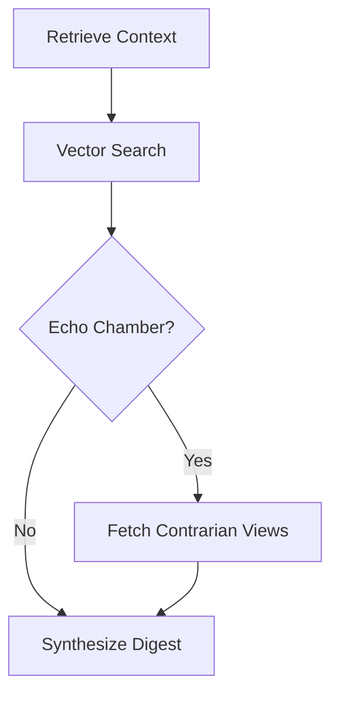

# About the Project — AmpliNews

## Inspiration

Every one of us has felt it: you open a news app, and it feeds you more of what you already believe. Click a left-leaning headline, and tomorrow you get five more just like it. Click a right-leaning one, and the algorithm quietly steers you the other way. Engagement-optimized feeds are extremely good at one thing — keeping you scrolling — and that goal is fundamentally at odds with keeping you *informed*. Over months and years, this quietly narrows what people see, reinforces existing beliefs, and widens the gap between "sides" that are often arguing from entirely different sets of facts.

We wanted to build something that inverts that incentive: an agent that doesn't just optimize for what you'll click next, but actively **audits your own media diet** and nudges you back toward balance when it notices you drifting into an echo chamber. Not by hiding what you like, but by treating "you're only reading one perspective on this topic" as a signal to correct for — the way a good editor, or an opinionated friend, would say *"okay, but have you seen the other side of this?"*

The **CockroachDB × AWS Hackathon** gave us the perfect excuse to build this properly: a distributed SQL database with native vector search (`pgvector` + HNSW indexing) meant we could treat semantic similarity between articles and user interests as a first-class, persistent, queryable concept — not a bolt-on. That became the technical seed for the whole project.

## What We Learned

- **Vector search is a database problem, not just an ML problem.** Getting embeddings into a table is the easy part. Making HNSW indexes stay fast as the table grows — while also supporting exact-match filters (topic, source, recency) alongside similarity search — taught us a lot about how CockroachDB's distributed architecture handles vector workloads differently from a single-node Postgres instance.
- **Agentic workflows need explicit state, not just prompts.** Early on we tried to cram "detect echo chamber → maybe fetch contrarian article → synthesize digest" into a single LLM call. It was unreliable. Rebuilding it as an explicit **LangGraph** state machine — with distinct nodes for context retrieval, similarity search, bubble detection, contrarian retrieval, and synthesis — made the agent's behavior debuggable, testable, and dramatically more consistent.
- **Cold storage and hot storage need different data shapes.** We learned the hard way that keeping 384-dimensional embeddings for *every* article ever ingested, forever, will eventually strangle an HNSW index's performance. Designing a tiered storage lifecycle (hot in CockroachDB → cold in S3) taught us to think about vector data the way you'd think about log retention: recent data is precious and needs to be fast; old data needs to be cheap and just needs to still exist.
- **Serverless orchestration (EventBridge → Lambda → SES) is powerful but unforgiving about cold starts and idempotency.** Digest generation had to be safe to re-run without double-sending emails or double-archiving articles.
- **Bias detection is a spectrum problem, not a classification problem.** We initially tried to hard-label articles as Left/Center/Right. It was far more useful — and far more honest — to treat political leaning as a continuous embedding dimension the agent reasons over probabilistically, rather than a rigid tag.

## How We Built It

**Architecture at a glance:**

$$
\text{User} \rightarrow \text{React/Vite UI} \rightarrow \text{FastAPI} \rightarrow \text{LangGraph Agent} \leftrightarrow \text{CockroachDB (pgvector)} \rightarrow \text{S3 (cold archive)}
$$

with **AWS EventBridge → Lambda → SES** running the daily digest pipeline in parallel.

**1. Data & Memory Layer — CockroachDB**
CockroachDB Cloud Serverless is the persistent brain of the whole system. We store:
- `user_profiles` with an `interest_embedding` vector that drifts over time as reading behavior accumulates.
- `articles` with 384-dimensional embeddings (from `bge-small-en-v1.5`) indexed via HNSW for fast approximate nearest-neighbor search.
- `reading_history` and `agent_memory` tables that log every read, like, share, and "too biased" / "show me the other side" interaction.

Given similarity between a user's interest vector and an article's embedding, the agent computes a relevance score roughly of the form:

$$
\text{score}(u, a) = \cos(\vec{v}_u, \vec{v}_a) = \frac{\vec{v}_u \cdot \vec{v}_a}{\lVert \vec{v}_u \rVert \, \lVert \vec{v}_a \rVert}
$$

and separately tracks a rolling **echo-chamber risk** as the proportion of a user's recent reads drawn from a single leaning bucket over a trailing window (e.g. the last 7–30 days), triggering contrarian retrieval whenever that proportion crosses a threshold.

**2. Agent Layer — LangGraph + Groq**
The agent is a LangGraph state graph, not a single prompt:

Each node is a discrete, testable step. Reasoning, topic classification, and sentiment/bias analysis run on Groq's `llama-3.1-8b-instant` for low-latency inference, which mattered a lot once we were generating digests for many users on a schedule rather than one chat response at a time.

**3. Tiered Storage & Offloading — the Phase 10 milestone**
This was the capstone technical piece: articles older than 30 days are automatically archived to S3 as compressed JSON, and their heavy 384-d embeddings are **nulled out** in CockroachDB. This keeps the HNSW index lean and fast for the articles that actually matter for live recommendations, while retrieval of an archived article transparently pulls it back from S3 on request — the user never notices the difference.

**4. Serverless Delivery — AWS**
EventBridge fires a daily cron trigger, invoking a Lambda that runs the LangGraph pipeline end-to-end and sends the resulting digest via SES, alongside making it available on the React dashboard.

**5. Web Layer**
FastAPI (Python 3.11+) exposes the REST API and orchestrates agent invocation; React 19 + Vite + Tailwind renders a dashboard with bias meters, credibility badges, and "why this?" reasoning surfaced directly from the agent; Supabase handles auth and session/JWT validation.

## Challenges We Faced

- **Keeping HNSW indexes performant as the article corpus grew.** This is what ultimately drove the entire tiered-storage design — without offloading, index build/query time degraded noticeably once we crossed a few tens of thousands of embedded articles.
- **Avoiding "contrarian for contrarian's sake."** An early version of the bubble-detection logic was too aggressive and started surfacing extreme or low-credibility opposing articles just to hit a "balance" target. We had to add a credibility floor so contrarian suggestions are still trustworthy sources — the goal is perspective, not just disagreement.
- **Making the archived-article retrieval genuinely transparent.** Round-tripping to S3 for a cold article, decompressing it, and re-hydrating it into the same response shape as a "hot" article (without the frontend ever knowing the difference) required careful service-layer design in `backend/services/archival.py`.
- **CockroachDB's distributed nature surfaced real constraints** around vector index behavior and connection handling that don't show up on a single-node Postgres setup — we documented these directly as we hit them so the tradeoffs stayed visible to the team.
- **Idempotency in the Lambda/EventBridge pipeline.** A daily digest job that fails partway through must be safely re-runnable without duplicate emails or duplicate archival writes — this pushed us toward more explicit state tracking in the pipeline itself.
- **Balancing personalization against its own failure mode.** The entire point of the product is to fight algorithmic bias — which meant constantly checking that our *own* recommendation logic wasn't quietly re-introducing the exact bias we set out to correct for.
